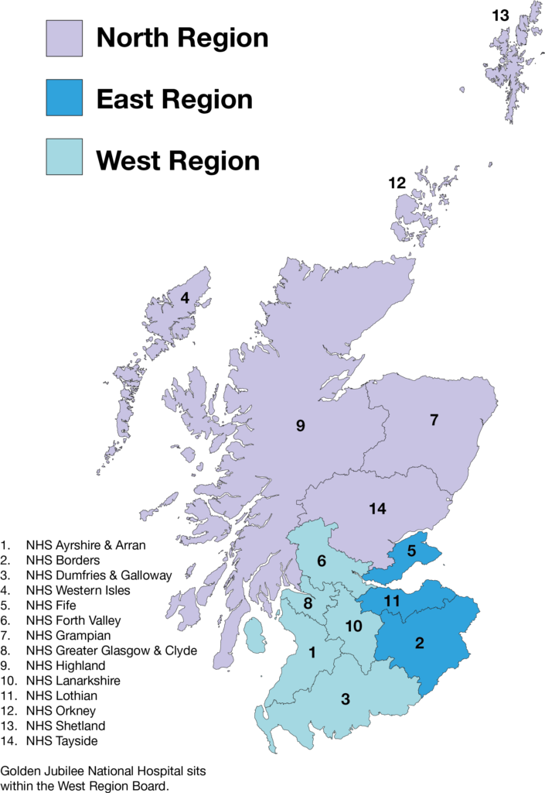

```{r setup, include=FALSE}
knitr::opts_chunk$set(echo = TRUE)
```

```{r libraries-and-data, message=FALSE, warning=FALSE}
library(tidyverse)
library(prettydoc) #for other theme options 
library(rmdformats) #for other theme options 
library(gapminder) #for our data
library(knitr) #for report generation 
library(kableExtra) #for pretty tables 

#save the gapminder data into the working environment & create some variables for analysis 
mydata <- gapminder %>% 
  # round gdpPercap to 0 decimals:
  mutate(gdpPercap = round(gdpPercap)) %>% 
  # divide pop by million, round to 1 decimal:
  mutate(pop_millions = (pop/1e6) %>% round(1))

# correlation for inline code example below 
LePcor <- cor.test(mydata$lifeExp, mydata$pop)
```

# Tables

When making tables, it is a good idea to use the `kbl()` function from the `kableExtra` package and to produce nice looking tables rather than the usual r output. Note that the `kbl()` function is similar to `kable()` function from the `knitr` package.

Compare this table output: 

```{r table-data-plain}
mydata %>% 
  select(-pop) %>% 
  sample_n(10) 
```

To this one: 

```{r table-data}
mydata %>% 
  select(-pop) %>% 
  sample_n(10) %>%
  kbl()
```


For further styling options, the [vignette](https://cran.r-project.org/web/packages/kableExtra/vignettes/awesome_table_in_html.html) and [bookdown chapter](https://bookdown.org/yihui/rmarkdown-cookbook/kableextra.html) can help!

Below I have grouped the data by `continent`, renamed the variables/columns from what they are called in the dataset, and added a caption to the table. 

```{r table-data-styled}
mydata %>%
  select(-pop) %>%
  sample_n(10) %>% # this line of code, randomly selectes 10 countries
  kbl(
    caption = "Any title that you want",
    col.names = c(
      country = "Country",
      continent = "Continent",
      year = "Year",
      lifeExp = "Life Expectancy",
      gdpPercap = "GDP per Capita",
      pop_millions = "Population (millions)"
    )
  ) %>%
  kable_styling() # Bootstrap theme

# Try replace "kable_styling" with:
# "kable_paper("hover", full_width = F)"
# "kable_classic(full_width = F, html_font = "Cambria")"
# "kable_minimal()" for different themes! 

```


# Figures 

You can easily integrate figures into your report as well using a code chunk dedicated to the figure of interest. 

```{r figure, message=FALSE}

mydata %>% 
  filter(year == 1977) %>% 
  ggplot(aes(y = lifeExp, x = gdpPercap, colour = continent)) +
  geom_point(alpha = 0.3) +
  theme_bw() +
  geom_smooth(method = "lm", se = FALSE) +
  scale_colour_brewer(palette = "Set1") + 
  labs(x = "Gross domestic product per capita",
       y = "Life expectancy",
       title = "Health and economics",
       subtitle = "Gapminder dataset, 1977")

```

# Images 

You can easily insert images into your R Markdown file either from a webpage or from a file in the same directory: 

1. From a webpage 


To get the link to a picture from a webpage go to your internet browser of choice, Images, and right click on the image and select "Copy Image Link".

**Note**: When knitting to pdf, you need to add another line of code in the YAML for LaTeX `graphicx` to pull an image from the internet and then save them locally in the same directory as the RMD file. 

    `output:
       pdf_document:
         pandoc_args: ["--extract-media", "."]`

2. From a file 


**Note**: to knit this document on your own device, you will need to change the file path above in number 2. "figures/Map of Health Boards.png" means go to the "figures" folder and find the file called "Map of Health Boards.png". If you do not have a figures folder within your working environment, you will get an error when trying to knit the document. 

# Inline Code 
You can also use r code directly in text. For example: 

> There are `r mydata %>% nrow()` observations in the data set. 

This can be an incredible time saver if you are creating a report where the data itself might still be coming in. Rather than needing to manually update descriptive information such as how many observations there are in the data set, let R do it for you! 

I also will often use this when reporting in text results of analyses. For example: 

> The correlation between life expectancy and population is $r$(`r LePcor$parameter`) = `r round(LePcor$estimate, 3)`, $p$ = `r round(LePcor$p.value, 3)`

## Mathematical notation 

You will notice above that I used something else in combination with the inline r code - mathematical notation! This is based on LaTeX. In side a text chunk, you can use mathematical notation if you surround it by dollar signs `$` for “inline mathematics” and `$$` for “displayed equations”. [This post by R Pruim](https://rpruim.github.io/s341/S19/from-class/MathinRmd.html) is my go-to resource for mathematical notation in R Markdown. 

# Functionalities {.tabset}

## HTML 

In general, I find that when knitting to an `html_document` there are more interesting functionalities. Indeed, Markdown was originally designed for HTML output so the HTML format has the richest features. 

* floating table of contents 
* code download output option 
* code folding (hide or show)
* tabbed sections 

You can have a look at some of the other options when knitting to HTML in the [HTML document chapter in R Markdown: The Definitive Guide](https://bookdown.org/yihui/rmarkdown/html-document.html#appearance-and-style)

Chunk names are not necessarily required to knit, but are good practice and help to support more advanced knitted approaches. Chunk labels should be 

* unique 
* do not use spaces, rather use dashes (-) 
* use alphanumeric characters (a-z, A-Z and 0-9), because they are not special characters and will surely work for all output formats
* spaces and underscores in particular, may cause trouble in certain packages, such as `bookdown`. 

We do not cover the `bookdown` package as part of this course, but it extends the functionality of rmarkdown to allow for figures and tables to be easily cross-referenced within your text (among other things). 

## PDF 

PDFs in R Markdown also have a variety of features, but not nearly as many as HTML documents. To find out more, check out the [PDF document chapter in R Markdown: The Definitive Guide](https://bookdown.org/yihui/rmarkdown/pdf-document.html) 

## Word 

The most notable feature of Word documents in R Markdown is the ability to create a "style reference document". To find out more, including a short video on how to create and use a reference document, check out the [Word document chapter in R Markdown: The Defintive Guide](https://bookdown.org/yihui/rmarkdown/word-document.html)

## Themes 

In general, there are a [variety of theme options available](https://www.datadreaming.org/post/r-markdown-theme-gallery/) to use with R Markdown HTML documents 

### `prettydoc`

The `prettydoc` package includes a variety of other theme options when knitting to HTML: https://prettydoc.statr.me/index.html

Once you have installed the package, you can open a prettydoc formatted document from "From Template" tab when choosing to create a new R Markdown file. 

To use a `prettydoc` theme not from a template, you need to edit the YAML accordingly: 

    `output:
        prettydoc::html_pretty:
        theme: cayman`

*Note:* When using `html_pretty` engine for themes, `code_folding`, `code_download`, and `toc_float` are not applicable.

### `rmdformats`

The `rmdformats` package includes a variety of other theme options when knitting to HTML: https://github.com/juba/rmdformats. Some themes allow for things like a dynamic table of contents, but not all of them. See the "Features matrix" table on the above webpage for more info. 

Similar to above, once you have installed the package, you can open a rmdformts formatted document from "From Template" tab when choosing to create a new R Markdown file. 

To use a `rmdformats` theme not from template, you need to edit the YAML accordingly: 

    `output:
        rmdformats::robobook`

# Reproducibility! 

In practice, depending on your audience, you will need to decide to show your code or not. It is unlikely that you will want to show the code used to produce your analysis, tables, or figures to an audience unfamiliar with R and would therefore set `echo = FALSE` in the set-up chunk. For this course, though, and in particular for the programming assignment, you will need to set `echo=TRUE` so that we can see your code and the product of that code. 

While it can take up space, it is good practice to finish a document calling the `sessionInfo` function, which lists all of the packages you used, their versions, and more. 

```{r session-info, echo=FALSE}
sessionInfo(package = NULL)
```


